## Hardware Required

<a href="https://raw.githubusercontent.com/garethky/Slice-Mosquito-Direct-Tool-Head/master/images/assembly/required-hardware.jpg">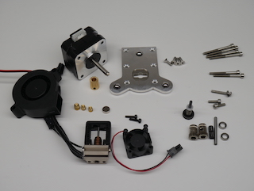</a>

* [Slice Mosquito Hot End](https://www.sliceengineering.com/collections/mosquito-the-professional-hotend). It does come with all the 2.5mm screws you will need to mount it. Note that the [cooling fan](https://www.sliceengineering.com/collections/accessories/products/fan-for-mosquito-hotend%E2%84%A2), [thermistor](https://www.sliceengineering.com/collections/accessories/products/thermistor-high-temperature) and [heater cartridge](https://www.sliceengineering.com/collections/accessories/products/50w-heater-cartridge) are not included and need to be purchased separately. E3D header cartridges and thermistors will work but the fan is particularly difficult to source so make sure your get that.
* Bondtech BMG Parts. They can be ordered as 'Spare Parts' directly from Bondtech (or from one of their local distributors like Filastruder) and wont cost as much as an entire BMG extruder:
    * 1 x [Bondtech Gear Kit 1.75/5.0](https://www.bondtech.se/en/product/drivegear-kits/) thats for 1.75mm filament and M5 shafts. The idler shaft included in the kit will no be used.
    * 1 x [Motor Gear](https://www.bondtech.se/en/product/motor-gear/)
    * 1 x [Reduction Shaft Assembly](https://www.bondtech.se/en/product/shaft-assembly/)
    * 1 x [3.0 x 32mm Shaft](https://www.bondtech.se/en/product/shafts/) You will need to cut this down to 24mm to be used as the idler shaft. This is the same size that Prusa use in their MK3 idler design. It's not a standard Bondtech part.
    * 2 x [5mm x 8mm x 2.5mm Bearings](https://www.bondtech.se/en/product/ballbearing-5x8x2-5/)
    * 1 x [Thumb Screw Assembly](https://www.bondtech.se/en/product-category/spare-parts/bondtech-spare-parts/thumbscrew-assembly/)
* A NEMA 17 stepper, preferably a "pancake" 25mm stepper, such as the [LDO-42STH25-1404MAC](https://www.bondtech.se/en/product/nema-17-motor-slim-power-ldo-42sth25-1404mac-0-9-degree/)
* Hardware 
    * M3 socket head cap screws:
        * 4 x 35mm
        * 2 x 30mm
        * 1 x 20mm with washer (a button head would also work)
        * 1 x 15mm
        * 2 x 10mm
    * 4 x M3 x 10mm Flat Head Cap Screws
    * 1 x M3 x 5mm set screw
    * Melt in Brass inserts for plastics
        * 2 x M2.5 x 5.5mm brass inserts, such as these: https://www.amazon.com/dp/B07NBPGTY2
        * 1 x M3 x 4mm brass threaded insert, such as these: https://www.amazon.com/dp/B077CJV3Z9
        * Note: dont cheap out on these parts as they are safety critical, [see testing by CNC Kitchen](https://www.youtube.com/watch?v=G-UF4tv3Hvc).
* Short length of PTFE tubing (~30mm)
* 8mm x 3mm Magnet (This size is [not uncommon](https://www.amazon.com/s?k=8mm+x+3mm+neodymium+magnets))
* 7+ small zip ties
* E3D ToolChanger [Tool Plate](https://e3d-online.com/toolchanger-blank-plate)
* A 5015 24V cooling fan such as [this one](https://www.amazon.com/dp/B07WFKPLWY).

## Printing The Parts

<a href="https://raw.githubusercontent.com/garethky/Slice-Mosquito-Direct-Tool-Head/master/images/assembly/printed-parts.jpg">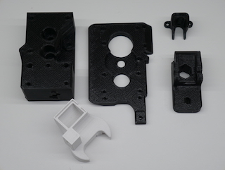</a>

Every part has a face that was designed to print down on the print bed to help eliminate the need for supports. The SLT files should correctly orient the parts in your slicer when imported.

The extruder parts were designed to be printed in PETG. But the Fan Nozzle should only be printed in ASA, ABS or another hight temp filament.

I suggest using these settings for the extruder parts:
* 0.4mm nozzle
* 0.2mm layer height
* 3 perimeters (hot melt inserts need some material to melt into)
* 20% Gyroid or Grid infill

# Assembly
## Prepare the Stepper Motor

<a href="https://raw.githubusercontent.com/garethky/Slice-Mosquito-Direct-Tool-Head/master/images/assembly/motor-gear.jpg">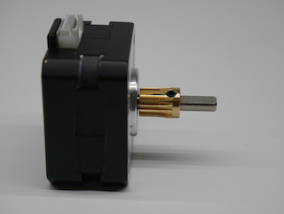</a>

1. Install the drive gear on the stepper shaft so the toothed end faces the stepper and just clears the face of the stepper.

## Mosquito Preparation

<a href="https://raw.githubusercontent.com/garethky/Slice-Mosquito-Direct-Tool-Head/master/images/assembly/mosquito-built.jpg">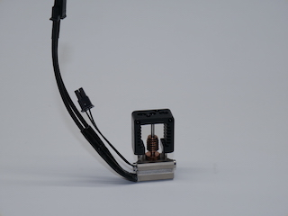</a>

1. Install the heater and thermistor in the orientation shown. Follow Slice Engineerings instructions for doing this.

## Prepare the Hot End Block

<a href="https://raw.githubusercontent.com/garethky/Slice-Mosquito-Direct-Tool-Head/master/images/assembly/install-magnet.jpg">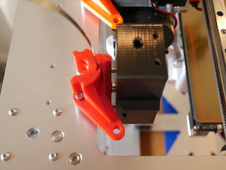</a>

1. Install the magnet in the Hot End Block. It should be a press fit. Verify the magnet polarity with the Dock before installing. Use some thin CA glue to lock the magnet in permanently if desired. There is a hole in in the block that allows the magnet to be pushed out if polarity is wrong and for glue to get in.

<a href="https://raw.githubusercontent.com/garethky/Slice-Mosquito-Direct-Tool-Head/master/images/assembly/how-to-cut-ptfe.jpg">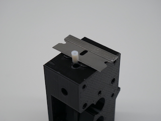</a>

2. The extruder uses a very short length of PTFE tube to guide the filament into the Mosquito. The PTFE needs to be cut for length such that it fits into the 1mm deep pocket on top of the Mosquito, here is how to do that easily without measuring:
	1. Start with a longer length of PTFE tube thats easier to handle (30+mm).
	1. Cut one end square.
	1. Fully insert the square end of the PTFE tube into the bottom of the Hot End Block untill it stops (about 20mm).
	1. Cut the PTFE to final length by lining up a razor blade with the two locating bumps on the Hot End Block and cutting through the PTFE. The bumps stick out 1mm and act as a guide.

<a href="https://raw.githubusercontent.com/garethky/Slice-Mosquito-Direct-Tool-Head/master/images/assembly/brass-inserts.jpg">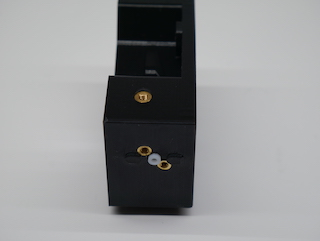</a>

3. With the PTFE tube in place (this helps to prevent the thin walls from melting!), install the M2.5 brass threaded inserts for the Mosquito.
4. Install the M3 threaded insert for the Idler tension knob.

## Prepare the Idler

1. Cut away the printing support material in the tension knob hole/slot area with an exacto knife.
1. Place the Bontech idler gear with its two needle bearings into its final location in the idler. The hobbed section of the gear goes in front of the viewing window.

<a href="https://raw.githubusercontent.com/garethky/Slice-Mosquito-Direct-Tool-Head/master/images/assembly/cut-idler-shaft.jpg">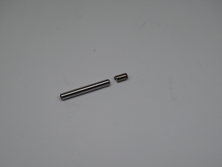</a>

3. Cut the 32mm x 3mm shaft down to 24mm.

<a href="https://raw.githubusercontent.com/garethky/Slice-Mosquito-Direct-Tool-Head/master/images/assembly/insert-idler-shaft.jpg">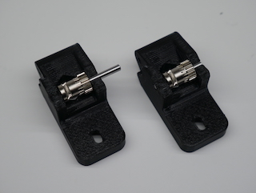</a>

4. Insert the 24mm x 3mm shaft through the assembly so that it does not protrude from either side of the Idler. Reasonable force is required as these parts are an interference/pretensioned fit. The idler gear should now spin freely and have a tiny amount of play left to right. 

## Assemble the Drive Line

1. Install the bearings in the Motor Plate and Hot End Block. A pencil or pen is a good tool to push them in with.

<a href="https://raw.githubusercontent.com/garethky/Slice-Mosquito-Direct-Tool-Head/master/images/assembly/insert-reduction-shaft.jpg">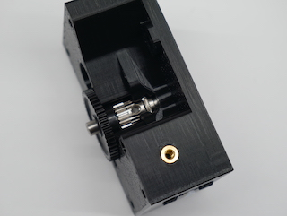</a>

2. Place the Bondtech drive gear onto the reduction shaft and install the assembly into the bearing you just placed in the Hot End Block.

<a href="https://raw.githubusercontent.com/garethky/Slice-Mosquito-Direct-Tool-Head/master/images/assembly/assemble-extruder-body.jpg">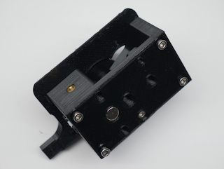</a>

3. Mate beaing in the Motor Plate to the other end of the shaft.
4. Insert 3 of the 35mm screws into the location for the stepper motor to use as alignment guides. They pass through the Motor Plate.
5. Install 2 x 30mm bolts into the bottom of the hot end block. These thread into plastic in the Motor Plate. Start the threads but don't tighten yet.

<a href="https://raw.githubusercontent.com/garethky/Slice-Mosquito-Direct-Tool-Head/master/images/assembly/install-idler.jpg">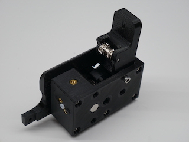</a>

6. Install the idler with the last 35mm long screw as its pivot. Snug the idler screw but do not over tighten. The idler should swing freely on its pivot. If it doesn't swing freely, you might have a little over extrusion on the idler sides that can be sanded down.
7. Tighten the two 30mm screws at the bottom now.

## Aligning the Bondtech Gear Train

<a href="https://raw.githubusercontent.com/garethky/Slice-Mosquito-Direct-Tool-Head/master/images/assembly/align-bondtech-gear-with-filament.jpg">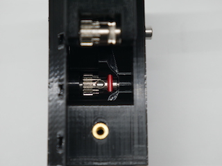</a>

1. Insert a piece of filament through the extruder. It should pass though the hobbed section of the drive gear and hold it in place.
1. Now you can move the reduction shaft left and right while the drive gear stays in place. Try to center the large black plastic reduction gear between Motor Plate and the Hot End Block.
1. Tighten the set screw in the Bondtech drive gear to lock in this position.

You should get a free running gear train that does not rub on either of the printed parts when the filament is pulled through the extruder.

## Final Assembly

<a href="https://raw.githubusercontent.com/garethky/Slice-Mosquito-Direct-Tool-Head/master/images/assembly/attach-stepper-motor.jpg">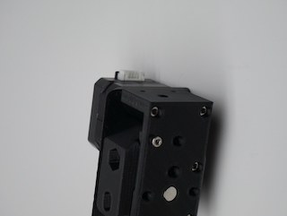</a>

1. Attach the stepper with the 3 x 35mm screws.

<a href="https://raw.githubusercontent.com/garethky/Slice-Mosquito-Direct-Tool-Head/master/images/assembly/Install-tension-knob.jpg">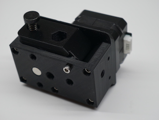</a>

2. Install the idler tension knob.
    1. Prusa says you only need enough tension to get the filament to feed and not slip. At this point you should still be able to insert filament by hand.

<a href="https://raw.githubusercontent.com/garethky/Slice-Mosquito-Direct-Tool-Head/master/images/assembly/mosquito-screws-tight.jpg">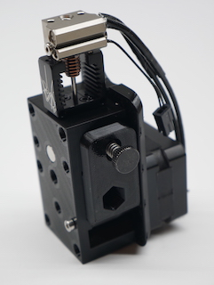</a>

3. Install the Mosquito onto the Hot End Block with the M2.5 x 10mm bolts included with the Mosquito kit (the longest ones). Make sure the heater cartridge/thermistor faces the idler side of the extruder.

<a href="https://raw.githubusercontent.com/garethky/Slice-Mosquito-Direct-Tool-Head/master/images/assembly/mosquito-cooling-fan.jpg">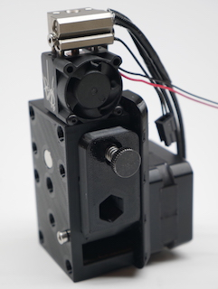</a>

4. Install the fan with its included button head screws and have its wires join up with the thermistor/heater wires.

<a href="https://raw.githubusercontent.com/garethky/Slice-Mosquito-Direct-Tool-Head/master/images/assembly/inital-wire-routing.jpg">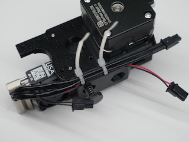</a>

5. Use 2 zip ties to hold the hater and fan wires to the wire guide as shown. You can route the thermistor wire in between the heater wires so it stays centered but don't zip tie it at this time.

<a href="https://raw.githubusercontent.com/garethky/Slice-Mosquito-Direct-Tool-Head/master/images/assembly/toolchanger-plate-attached.jpg">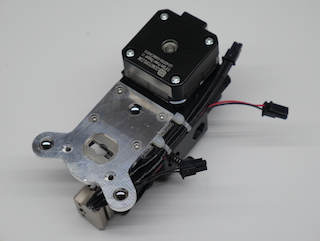</a>

5. Attach the E3D ToolChanger plate with the 4 M3 x 10mm screws

<a href="https://raw.githubusercontent.com/garethky/Slice-Mosquito-Direct-Tool-Head/master/images/assembly/part-cooling-fan.jpg">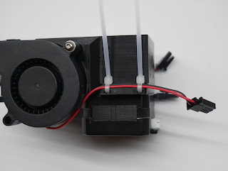</a>

7. Attach the 5015 fan with 1 M3 x 20mm screw with washer

<a href="https://raw.githubusercontent.com/garethky/Slice-Mosquito-Direct-Tool-Head/master/images/assembly/part-cooling-fan-wire-clears-tool-plate.jpg">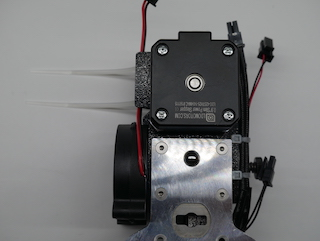</a>

8. Use 2 zip ties to secure the 5015's fan wire to the wire guide. The wire should remain clear of the ToolChanger Tool Plate area.

<a href="https://raw.githubusercontent.com/garethky/Slice-Mosquito-Direct-Tool-Head/master/images/assembly/cable-support.jpg">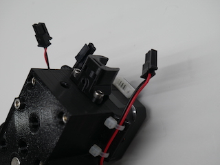</a>

9. Attach the Cable Support with the 2 M3 x 10mm screws.
10. Install the M3 x 5mm set screw into the hole in the cable support.

<a href="https://raw.githubusercontent.com/garethky/Slice-Mosquito-Direct-Tool-Head/master/images/assembly/part-cooling-nozzle.jpg">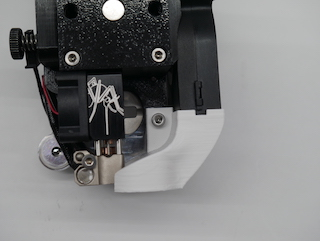</a>

11. Finally attach the part cooling nozzle with an M3 x 15mm screw. 

## Attaching The Tool
Connection are be made in the same way that the stock V6 tool. The umbilical cable needs to be modified to get a stepper drive cable to the extruder. This is not something that I'm going to try and cover here.

<a href="https://raw.githubusercontent.com/garethky/Slice-Mosquito-Direct-Tool-Head/master/images/assembly/cable-routing-tip.jpg">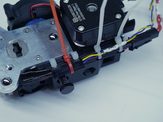</a>

One specific suggestion to keep things neat is to pass a zip tie (pictured in red) behind the thermistor wires  to clamp the thermistor connector in place.

The stepper motor will collide with the stock X-Carriage Cable Bracket. An alternative part is included: (Modified X-Carriage Cable Bracket)[STL/X-Carriage Cable Bracket.stl]
This is a modification the stock E3D part and should be a drop in replacement. 

Next Step: [Extruder Setup and Tuning](setup.md)
