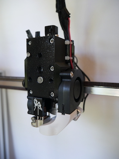
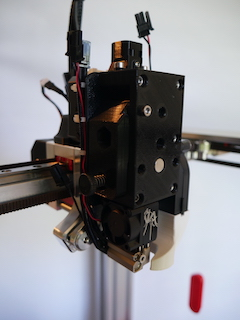
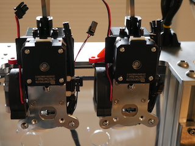

# About

This is a tool designed for the E3D Tool Changer platform. It uses the Bondtech Mini Gear (BMG) drive parts and the Slice Engineering Mosquito for a compact and light weight direct drive extruder.

# Source

The project was designed in OnShape and you can access the released design here: [E3D Tool Changer - Bondtech Mini Gear (BMG)/Slice Mosquito Tool Head](https://cad.onshape.com/documents/296b560eee7721bd4ef989d0/w/90142d42ff99dde68f53c17c/e/d21c095bd78c720c7f814c17). 

The project is configured to allow forking and export of .stl and other formats. Work may be in progress, for the latest tested .stl files please use this github repo.

STL files, this readme and these assembly instructions are maintained on [GitHub - Slice-Mosquito-Direct-Tool-Head](https://github.com/garethky/Slice-Mosquito-Direct-Tool-Head), you can also file an issue there.

## Why Build One?
* It's a geared direct drive extruder that can print faster and more precisely that the stock bowden tooling.
* The Mosquito hot end makes it very easy to swap nozzles without worrying about filament oozing out of your hot end. "Volcano" version of the Mosquito has the same nozzle hight so they can share wipers/brushes.
* It uses the stock dock pins in its stock location. No dock mods required.
* Light weight. Measured as 400g all up weight with tool plate.
* 5015 part cooling for quiet and powerful cooling.
* Compact size, wont steal space from other tools or collide with the printer frame.
* Designed for manufacture on FDM printers with no required support material in PETG filament.

## Project Status: Beta
Currently this project is in Beta. Now is a good time to print an extruder and try it out for yourself. Before this release, several prototypes were printed and tested to failure. Improvements to the design have been made that should overcome these issues. Numerous print-ability tweaks have been made to eliminate the need for support material when printing. Print-ability, usability and general fit/finish should be fine for general use. I'm installing printing 4 on my tool changer so I can work on multi-material and multi-color printing.

## Required Parts, Printing & Assembly
[Assembly Instructions](assembly-instructions.md)

## Extruder Setup and Printing
Extruder Setup & Printing](setup.md)

# Q and A

### Is this done, will there be changes?

Oh there are going to be changes... when I get time:
1. Prusa Labs has released their filament sensor as open source and inexpensive third party kits are available. This will enable automated filament loading and unloading and filament runout detection. The next major release will have the filament sensor integrated as an optional add-on.
2. I'm not satisfied with the way the filament enters the extruder. This release eliminated the push fit connector I was using. Bondtech's connector is inexpensive and is being evaluated. for now simply using no connector is fine and makes filament swaps easier.
3. The Cable Support that attaches the metal band and wiring loom is something I want improve and possible integrate into the motor plate. The extra part and fasteners dont seem to be beneficial. Cable routing in general isnt as clean as I wanted.

### Will you adapt this design for the E3D V6?

The V6 mounts differently and the extruder would have to be split along the filament path to capture the mount. Thats a very big change and it wont be easy to maintain both versions. There is also the [Hemera](https://e3d-online.com/e3d-hemera-175-kit) which is a great value vs this design. You're free to fork the design if you like.

### How about Duet 3 Tool Board support?

I like the concept but the boards are kind of large. My worry with this is mostly about hwere to put it without making the whole package larger.

### That Mosquito fan is a menace

I noticed that too. Slice recommends running their fan at 70% (per https://www.sliceengineering.com/pages/documentation). Only the main Duet 2 board has PWM controlled ports for the hot end coolers to permit this. The Duet 3 expansion board has PWM fan ports. I'm upgrading to the Duet 3 and I'll be evaluating the noise at the 70% setting with 4 extruders. If thats too noisy, a mod to run a quieter fan would be something to consider. To have any benefit we would have to go up to the 40mm Noctua fan.

### Will you post this to Thingiverse/Prusa Printers/Other Platform

For the time being no. The audiance for this pretty narrow right now and for my workflow github is just nicer.

# Happy Printing!
